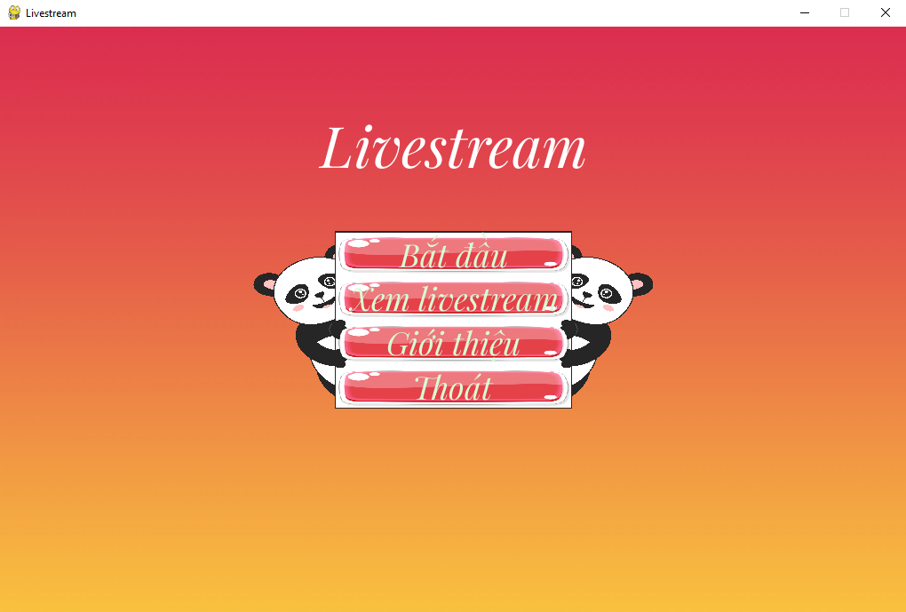
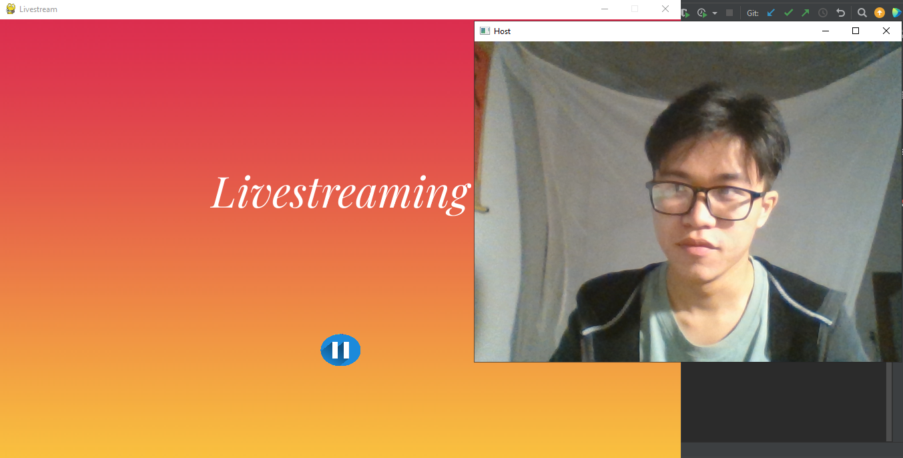
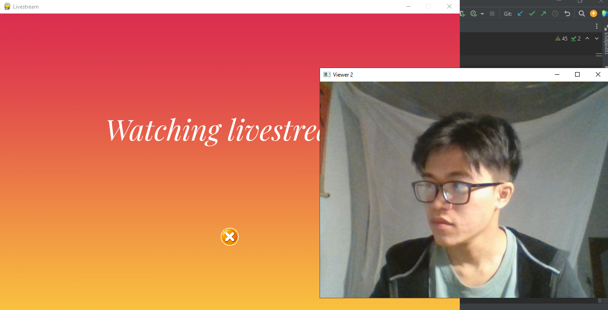

# **LiveStream App**

+ Dự án livestream cho phép người dùng xem và tạo livestream video trực tuyến. Đây là một trong những tính năng được ưa chuộng hiện nay.

## Mục đích

+ Phần mềm giúp người sử dụng xem được livestream trực tuyến

## Các thành viên tham gia :

* Phạm Thị Phương Anh - B20DCCN071
* Nguyễn Khánh Nam - B20DCCN454
* Võ Hữu Tuấn - B20DCCN622

## Công nghệ sử dụng :

+ Sử dụng ngôn ngữ lập trình python
+ Sử dụng giao thức TCP để truyền dữ liệu từ host đến server và truyền dữ liệu từ server tới các vỉewer
+ Sử dụng opencv để xử lý video
+ Sử dụng thread để phân luồng cho các host và viewer
+ Sử dụng pygame để thiết kế giao diện application

## Các chức năng chính :

1. [x] Giúp người tổ chức có thể mở kênh livestream
2. [x] Giúp người xem có thể tham gia xem livestream

## Các giao diện :

###### Giao diện chính:

###### Giao diện livestream:

###### Giao diện xem livestream:

## Hướng dẫn sử dụng :

1. Đầu tiên, cho chạy server.py để khởi động server
2. Sau đó, cho chạy main.py để hiển thị giao diện client. Người dùng có thể chọn bắt đầu livestream hoặc xem livestream

